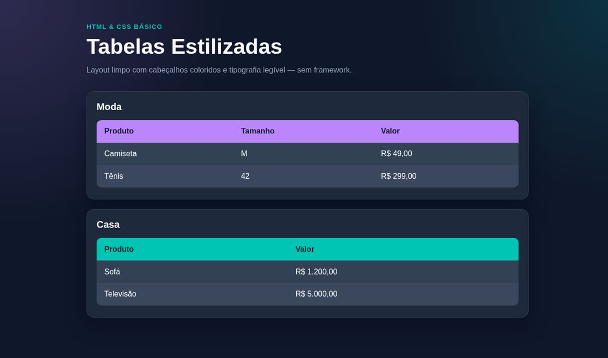

# Tabelas Estilizadas — Gastos Mensais

[](https://developer.mozilla.org/docs/Web/HTML)
[](https://developer.mozilla.org/docs/Web/CSS)
[](https://developer.mozilla.org/docs/Web/JavaScript)
[](LICENSE)

Aba principal de **gastos mensais** com cálculo ao vivo, mais demos estáticas de tabelas (Moda e Casa).

## Resultado

Aba principal **Gastos Mensais** com cálculo ao vivo (planejado vs realizado), status por linha, `localStorage` e export CSV — mais demos Moda/Casa.



**Demo online:** [denispaulo.github.io/aula-tabela](https://denispaulo.github.io/aula-tabela/)

## Funcionalidades

- Seletor de mês
- Colunas: Categoria, Descrição, Planejado, Realizado, Diferença, % do orçamento, Status
- Totais + barra de uso do orçamento
- Adicionar / remover linhas
- Persistência no navegador (`localStorage`)
- Exportar CSV (`;` + decimal BR)
- Status com cor **e** ícone/texto (No azul / Atenção / Acima)
- Empty state quando não há linhas
- Abas Moda e Casa como demos de tabela estilizada

## Como rodar

```bash
git clone https://github.com/DenisPaulo/aula-tabela.git
cd aula-tabela
```

Opções pra abrir:

1. **Mais simples:** abra o `index.html` no navegador (duplo clique).
2. **Com servidor local (Python):**

```bash
python3 -m http.server 5500
```

Depois acesse `http://localhost:5500`.

3. **Com Node (se tiver instalado):**

```bash
npx --yes serve .
```

## Estrutura

```
aula-tabela/
├── index.html
├── src/
│   ├── css/styles.css
│   └── js/app.js
├── docs/preview.jpg
└── LICENSE
```

## Aprendizados

- Tabelas semânticas e UI com abas
- Estado e cálculo no cliente com JavaScript
- Formatação `pt-BR` / BRL e exportação CSV
- Acessibilidade básica (`aria-*`, `scope`, labels)

## Licença

Distribuído sob a licença [MIT](LICENSE).

---

Feito por [Denis Paulo](https://github.com/DenisPaulo)
