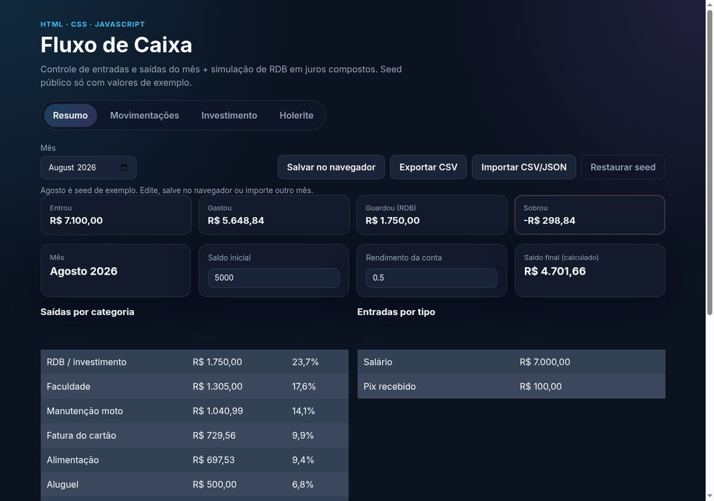
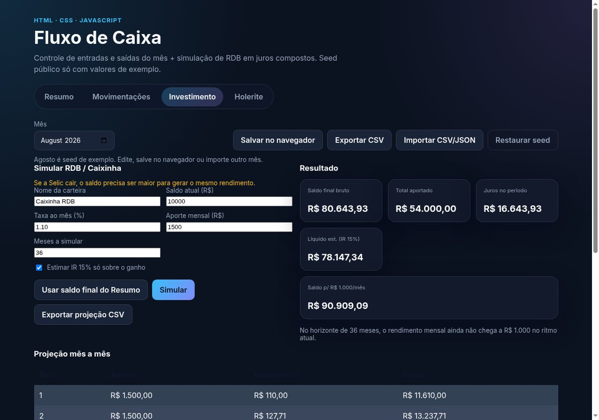

# Fluxo de Caixa + Investimento

Controle de **fluxo de caixa mensal** + **simulação de RDB** em juros compostos — HTML/CSS/JS, sem backend.

Nasceu como exercício de tabela HTML e evoluiu para fluxo de caixa + simulação de RDB.

## Resultado

Resumo com recibo Entrou / Gastou / Guardou / Sobrou + simulação de RDB (juros compostos, meta de R$ 1.000/mês e IR opcional).

**Demo:** [denispaulo.github.io/aula-tabela](https://denispaulo.github.io/aula-tabela/)

## Problema

Controlar o que entrou, o que foi gasto, o que foi guardado e projetar o saldo da caixinha/RDB no tempo.

## O que o app calcula

- Resumo: Entrou / Gastou / Guardou / Sobrou
- Totais e breakdown por categoria a partir das movimentações
- Simulação: `saldo[n] = saldo[n-1] * (1 + taxa) + aporte`
- Meta: em quantos meses o rendimento mensal passa de R$ 1.000
- Líquido estimado com IR 15% só sobre o ganho (opcional)

## Como usar

1. Abra o `index.html` (duplo clique) ou a Pages
2. Edite movimentações; o Resumo recalcula
3. **Salvar no navegador** · **Exportar CSV** · **Importar CSV/JSON**
4. Na aba **Investimento**, simule saldo/taxa/aporte/meses

> Agosto no seed é **exemplo anonimizado** (sem salário real, sem nomes, sem empresa). CSV real fica só no seu computador.

## Abas

1. Resumo  
2. Movimentações (filtro, busca, edição)  
3. Investimento (projeção RDB)  
4. Holerite (referência de exemplo)

## Testes manuais rápidos

1. Restaurar seed  
2. Conferir recibo Entrou / Gastou / Guardou / Sobrou  
3. Exportar CSV e reimportar sem perder linhas  
4. Simular 36 meses e exportar projeção  

## Próximos passos

- Vários meses no `localStorage`
- Aportes em degraus (pós-FIAP)
- Rename do repositório para `fluxo-caixa`

## Licença

MIT · [Denis Paulo](https://github.com/DenisPaulo)
